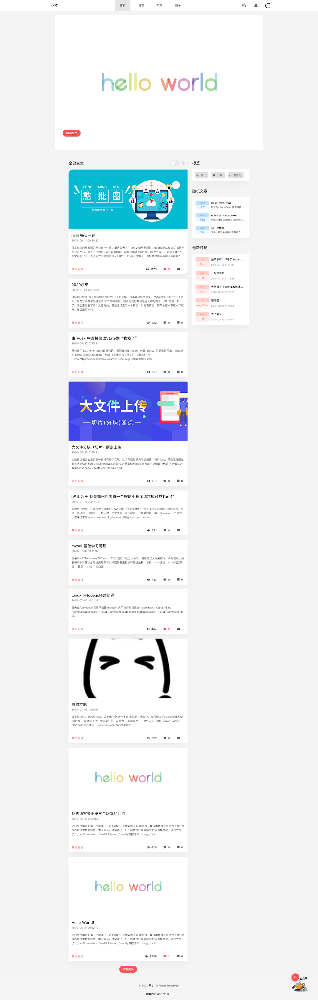

# 不才的博客😎

`巩固知识、打发时间` 本项目基于这两点进行开发，细节上可能存在缺陷。

## 🤩项目介绍
### 相关介绍  

> 博客主题样式根据 [YEVPT](https://yevpt.com/) ps: 嘤嘤嘤，还没他的好看  

1. 多人博客（每个人都可以发布文章，文章需审核）~~多人运动???~~
2. 后台动态角色/权限（超级管理员可进行配置）
3. 资源文件（图片、~~某些学习资料~~）集中管理
4. 全站`https`化
5. `RESETful api`规范化

### 🤬历史版本介绍
> 都是在校的时候写的  

第一版是java servlet写的 现在已经没有维护了[1.0](https://github.com/notbucai/blog)  
第二版是koa+mongo+ejs+bootstrap+jquery+layui 目前已经关闭，文章数据已迁移[[githubh2.0]](https://github.com/notbucai/blog-nodeJs) [[线上地址]](https://blog.ncgame.cc)。  

### 🙈未完成的

1. 消息通知（完全没做，大哭）
2. 点赞/喜欢功能 （预留）
3. 忘了。🙊（日常记性不行）
4. 细节方面

### 展示


## 👾技术栈

博客有点为了堆技术栈而堆技术栈的感觉。本人表示已经实锤了！！！  
原本是打算直接3n框架直接撸的，还是太懒了。。

大体: nest/nuxt/vue  
UI: ElementUI/Vuetify  
数据储存: mongo/redis/cookie/localStoreage  
通知：腾讯sms/email

部分配置文件没有上传到github，之后进行简化后上传
[[GitHub]](https://github.com/notbucai/blog3.0)  [[线上地址]](https://www.notbucai.com)  


### 部署

采用Docker进行容器化部署
> `tar --exclude=node_modules --exclude=dist --exclude=.nuxt --exclude=_config --exclude=.DS_Store --exclude=.git -zcvf ../blog3.tar.gz .`   
> `docker-compose up --build`  
> `docker-compose up -d`  

### 博客前端

> 使用 `Nuxtjs` + `Vuetify.js`

### 服务端 

> 使用 `nestjs` + `mongodb` + `redis` + `cos`

### 管理平台

> 使用 `Vuejs` + `Element UI`

## 😴目录结构

```
├── README.md            # 自述
├── admin                # 管理页面
│   ├── Dockerfile              # 管理页面 Dockerfile 配置 （ps: 目前无用）
│   ├── README.md               # 管理页面自述
│   ├── package.json
│   ├── public
│   ├── src                     # 项目目录
│   └── vue.config.js           # vue 配置文件
├── docker-compose.yml   # docker-compose 配置文件
├── front-end            # 博客前台页面
│   ├── Dockerfile
│   ├── README.md
│   ├── assets
│   ├── components
│   ├── constant
│   ├── jsconfig.json
│   ├── layouts
│   ├── middleware
│   ├── nuxt.config.js
│   ├── package-lock.json
│   ├── package.json
│   ├── pages
│   ├── plugins
│   ├── server
│   ├── static
│   ├── store
│   └── utils
├── package.json
└── server                # 博客服务端
    ├── Dockerfile
    ├── README.md
    ├── dist
    ├── nest-cli.json
    ├── package-lock.json
    ├── package.json
    ├── src
    ├── test
    ├── tsconfig.build.json
    ├── tsconfig.json
    ├── tslint.json
    ├── views
    └── yarn.lock

```

## 项目开发进度

> 2020-06-22 基础版本 项目部署  
> 2020-07-02 交互功能基本完善  

## 💥如何运行？

1. clone 本项目

2. 将 server/src/`_config` 改成server/src/`config`

2. 修改 `server/src/config/default.conf.ts` 文件中的配置

3. 安装个个项目中的依赖

4. 运行服务端  
> `cd server` && `npm run start:dev`  
5. 运行博客前端
> `cd front-end` && `npm run dev`  
6. 运行管理后台
> `cd admin` && `npm run serve`  

